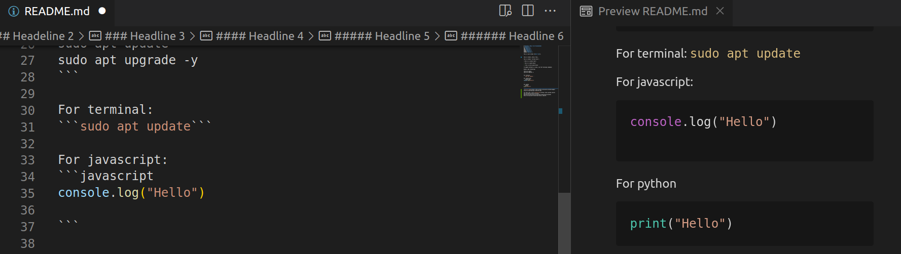

# Markdown (Repo title Recommended)
# Headline 1
## Headeline 2
### Headline 3
#### Headline 4
##### Headline 5
###### Headline 6

This is just normal **Bold Text**.


This is normal _Italic Text_.

This is normal ~~Strike Text~~.

~~This is a normal Text~~

> This is a quote Block

>> This is extra quote Block

To update software in Linux, use the following commands:

Normal code formatting:
```
sudo apt update
sudo apt upgrade -y
```

For terminal: 
```sudo apt update```

For javascript:
```javascript
console.log("Hello")

```

For python
```python
print("Hello")
```




For more info, visit [Github Docs](https://docs.github.com/en/get-started/writing-on-github/getting-started-with-writing-and-formatting-on-github/basic-writing-and-formatting-syntax) website.

